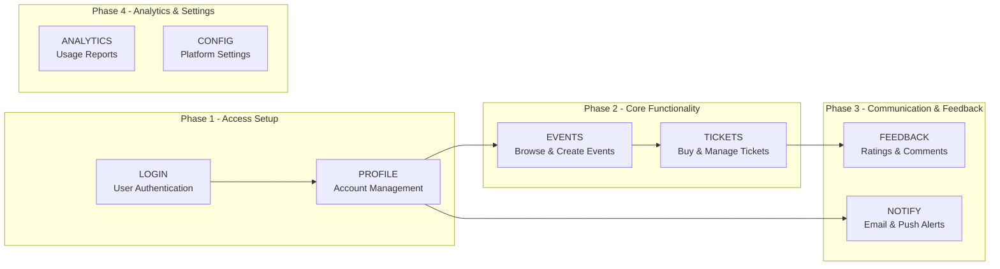

# 🧩 Epics Generator Prompt

You are a world-class requirements analyst and software architect. Your task is to analyze the product documentation and wireframes for the MVP and generate a **comprehensive and structured list of epics**.

This prompt **does not produce user stories**. Instead, it defines the top-level building blocks (epics) that will later be broken down.

---

## 🎯 Objective

Generate a list of epics based on the requirements document and available wireframes. Do not create user stories.

For each epic, include:

- A brief **description**
- Its **key features or capabilities**
- The related **wireframes** (if available)
- **Priority** (e.g., High, Medium, Low)
- The relevant **user type** (e.g., Consumer, Admin, Business Owner)
- An **argument why this is an epic** and not just a story or task
- Any known **dependencies** with other epics
- Any known **risks, blockers, or ambiguity areas**
- 🛠️ Required **Tooling / SDKs / APIs** (optional, if applicable)

---

## 📁 Inputs

You have full access to all relevant documentation. You **must** analyze and visually inspect the following:

- 📄 The product requirements document(s)
- 🖼 All wireframes (must be interpreted visually)
- ⚙️ Technical documentation available under the `technical/` directory

> Wireframes and product documents must be deeply analyzed — both textual and visual information are essential. This is a mandatory step.

---

## 🧵 Additional Guidelines

- Epics may span multiple screens or wireframes.
- Grouping can be screen-based or logical (cross-cutting); use your judgment.
- Do not mix client platforms. If functionality appears in both mobile and web, split into two epics.
- Always use **Sequential Thinking (MCP)**, including the Context7 variant, to ensure decomposition and grouping is disciplined, layered, and avoids hallucination.
- If there are edge cases not covered in docs but logically necessary, flag them in ⚠️.
- You are expected to identify and include critical setup or production-readiness epics if applicable to the type of product (e.g., initial infrastructure, CI/CD setup, release readiness).

---

## 📊 Output Format

```markdown
# 📦 Epic: [Epic Title]
**ID**: `EPIC-KEY`

## 🧠 Why This Is an Epic
Explain why this group of functionality deserves to be treated as an epic rather than separate stories.

## 📄 Description
High-level explanation of what this epic includes and what value it delivers.

## 🧰 Key Features
- Feature 1
- Feature 2
- Feature 3

## 🖼 Wireframes Referenced
- `/wireframes/screen-name.png`
- (none if no wireframes exist)

## 👤 User Type(s)
- Event Organizer / Attendee / Admin / System

## 💻 Target Platform
- mobile
- web-panel
- backend-only

## 🏁 Priority
High / Medium / Low

## 🔗 Dependencies
- Depends on EPIC-EVENTS
- Unblocks EPIC-FEEDBACK
- (none)

## ⚠️ Risks / Blockers / Ambiguities
- Missing business rules on ticket expiration
- Wireframe doesn’t match requirements for X
- Integration behavior unclear with calendar provider

## 🛠️ Required Tooling / SDKs / APIs
- Google Calendar API
- Stripe SDK
- (optional section – include only if clearly relevant)
```

> _The following examples use generic epics from an unrelated domain (event management platform) for illustration only._

---

## 📈 Visual Dependencies & Roadmap

### 1. Phased Grouping (Labeled by Batch)



---

### 2. Critical Path

- EPIC-LOGIN → EPIC-PROFILE → EPIC-EVENTS → EPIC-TICKETS

### 3. Workable in Parallel

- EPIC-NOTIFY
- EPIC-ANALYTICS
- EPIC-CONFIG

---

## 🧵 Additional Guidelines

- Use **Sequential Thinking (MCP)** and **Context7** when defining and organizing epics.
- Epics may span multiple screens or wireframes.
- Grouping can be screen-based or logical (cross-cutting); use your judgment.
- Always include **setup epics** (e.g., environment/infrastructure) and **deployment epics** if applicable to the delivery model (e.g., mobile store vs web launch).
- If there are edge cases not covered in docs but logically necessary, flag them in ⚠️.

---

## ✅ Goal

The resulting epics list will be used for:
- Story generation using a separate prompt
- Effort estimation and team planning
- Building a release roadmap with phases and parallelization

Be precise. Be grounded. Do not hallucinate.

---

## 📝 Output

- Generate a single **Markdown (.md)** file containing the full list of epics.
- Each epic must follow the defined structure and include all specified fields.
- The file should be named following this convention:  
  `epics-[project-name]-[phase].md`  
  Example: `epics-conference-app-mvp.md`

- If applicable, group epics by theme or module using level-2 headers (`##`).
- Maintain clarity and consistent formatting to support downstream use in:
  - Story generation
  - Technical estimation
  - Planning and roadmap reviews

- Do **not** include user stories. This file is strictly for epic-level analysis.